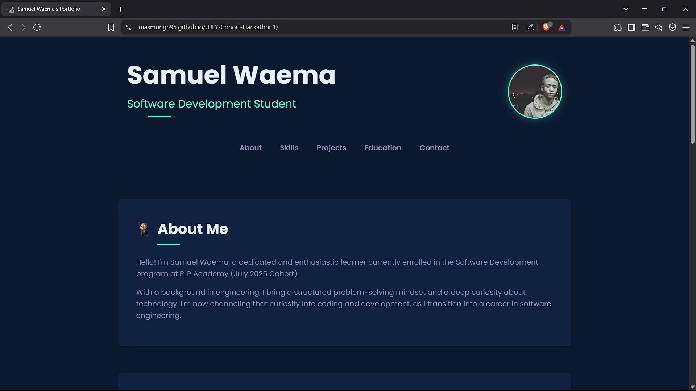
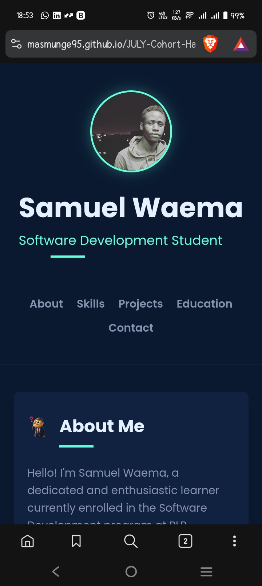

# Samuel Waema's Portfolio Website

Welcome to my personal portfolio website! This project serves as an introduction to who I am, my educational background, and my growing passion for technology — especially web development, artificial intelligence, and data science.


## 🌐 Project Overview

This portfolio has been completely revamped with a modern, professional, and fully responsive design. Built with **HTML5** and advanced **CSS3**, it showcases a clean, stylish aesthetic suitable for a software developer's profile.

The design features:
- A professional dark theme with a navy blue and teal color palette.
- A card-based layout for projects and skills.
- A fully responsive structure that looks great on desktop, tablet, and mobile devices.
 
## 📸 Screenshots
 
| Desktop View | Mobile View |
| :---: | :---: |
|  |  |


## 📁 Project Structure

```
├── index.html         # Main HTML file with all sections and internal links
├── styles.css         # Custom CSS styling (Dark theme, responsive design)
└── Assets/            # Folder containing images, icons, and CV
    ├── 20250730_130650.jpg               # Profile image and favicon
    ├── Samuel Waema Professional CV.pdf  # Downloadable CV
    ├── about-removebg-preview.png        # About section icon
    ├── graduation .png                   # Icon for education section
    ├── technician-removebg-preview.png   # Icon for interests section
    ├── code-removebg-preview.png         # Icon for programming languages section
    ├── presentation-removebg-preview.png # Icon for projects section
    └── contact-removebg-preview.png      # Icon for contact section
```


## 🛠️ Technologies & Techniques Used

-- **HTML5** — Semantic structure for each section and content block
-- **CSS3** — Custom styling with hover effects, fluid typography, and layout
-- **Responsive design** — Works well on desktop, tablet, and mobile devices
+- **HTML5**: Semantic structure for accessibility and SEO.
+- **CSS3**: Advanced styling for a modern look and feel.
+  - **CSS Custom Properties**: For a maintainable and consistent color scheme.
+  - **CSS Grid**: For creating the responsive card layouts.
+  - **Flexbox**: For aligning and distributing content within components.
+  - **Responsive Design**: Using media queries to ensure a seamless experience on all screen sizes.
+  - **Transitions**: For smooth hover effects on interactive elements.

## 📌 Features

- ✨ **Modern dark theme** with button accent colors
- 🖼️ **Icons** before section headers using custom background images
- 🎓 **Education section** with downloadable CV
- 📚 **Interests section** (Web Dev, AI, Data Science)
- 💻 **Programming Languages section** showing what's currently being learned
- 📂 **Projects section** with GitHub links (e.g., Python calculator)
- 📧 **Contact section** with email and Google Form
- 📱 **Mobile enhancements** including:
  - Horizontal nav bar with mobile stacking
  - Fluid font sizes using `clamp()`
  - Responsive images and improved touch targets
- 📜 **Footer** with author credits and copyright
 ✨ **Professional Dark Theme**: A clean navy and teal color palette.
- 📇 **Stylish Cards**: Projects and skills are presented in modern cards with hover effects.
- 📱 **Fully Responsive**: The layout fluidly adapts from large desktops to small mobile screens.
- 🎓 **Clear Sections**: Dedicated, well-structured sections for About, Skills, Projects, Education, and Contact.
- 📂 **Interactive Elements**: Includes a downloadable CV button and links to GitHub and a contact form.
- ✍️ **Modern Typography**: Uses the 'Poppins' font from Google Fonts for excellent readability.


## 🚀 Getting Started

You can visit the live site on GitHub Pages: **https://masmunge95.github.io/JULY-Cohort-Hackathon1/**

To run this project locally:

1. Clone or download the repository:
   ```
   git clone https://github.com/masmunge95/JULY-Cohort-Hackathon1.git
   ```
2. Ensure all files in the `Assets/` folder remain in place.
3. Open `index.html` in your browser.


## ✍️ Author

**Samuel Waema**  
📧 [waemasamuel95@gmail.com](mailto:waemasamuel95@gmail.com)

---
